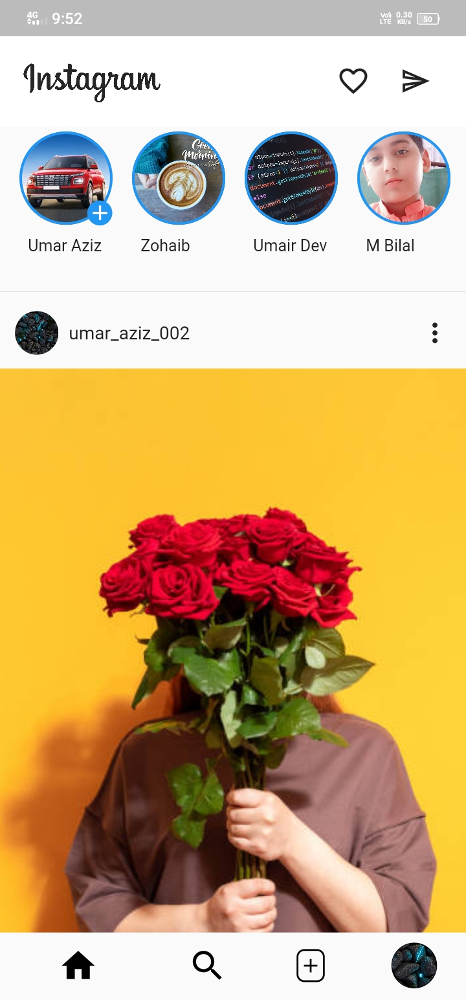
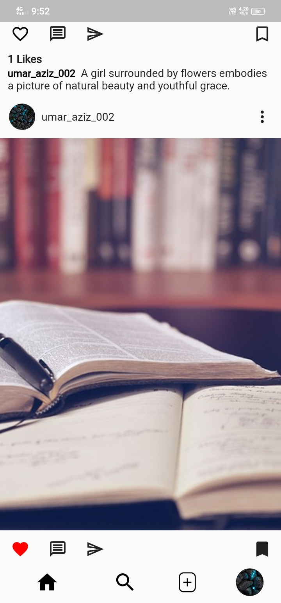
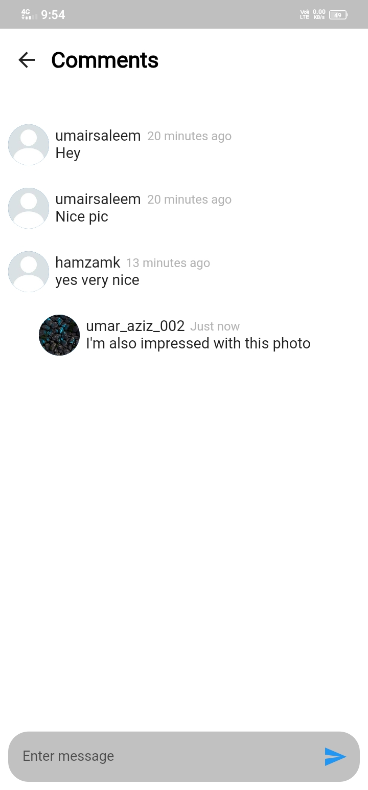
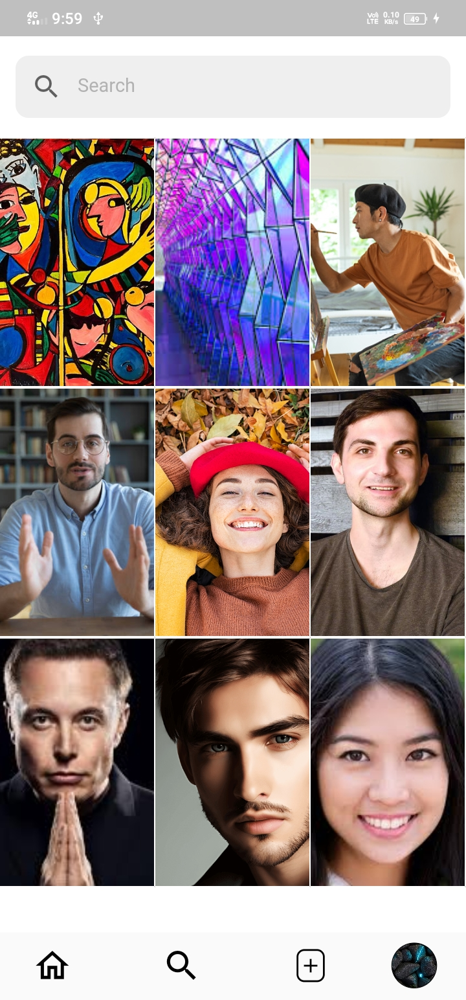
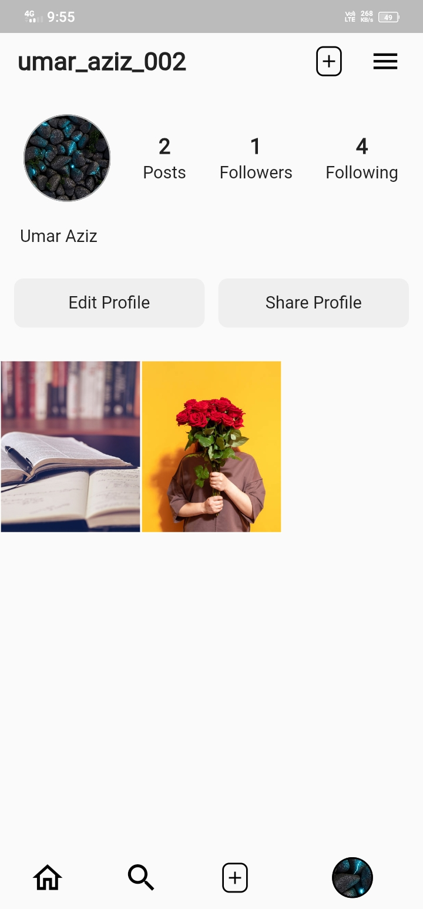
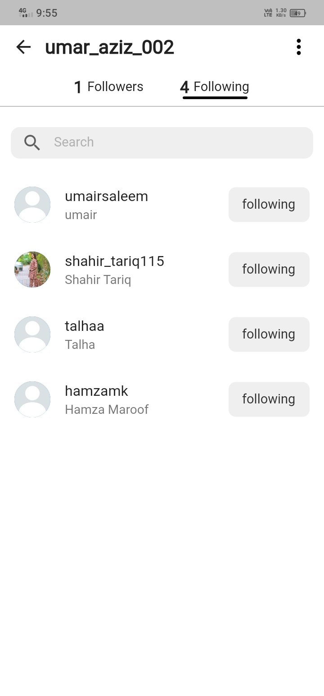
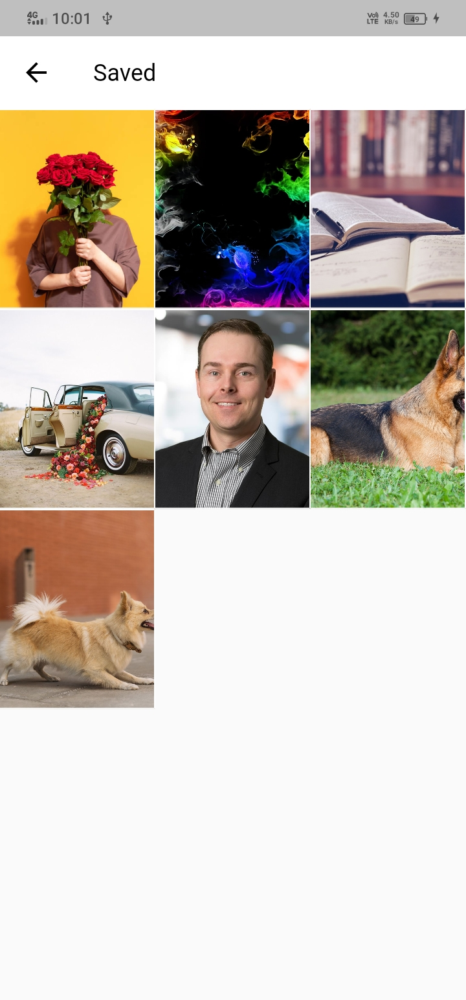

# 🔥 Instagram Clone in Flutter
## 👀 Overview

This is an Instagram clone built using the Flutter framework. The goal of this project is to replicate the core features and user interface of the Instagram mobile app. This project serves as both a learning resource for Flutter developers and a demonstration of Flutter's capabilities for building complex user interfaces.

## ✨ Features

- **🔐 User authentication**: Sign up and log in using email, phone number, and Facebook.
- **🏠 Home feed**: View posts from all users.
- **✍️ Post creation**: Create new posts.
- **❤️ Interactions**: Like and comment on posts.
- **👥 Social features**: Follow and unfollow users.
- **👤 User profile**: View posts, followers, and following lists.

## 📸 Screenshots

| Home Feed | Profile | Post Creation |
|---|---|---|
|  |  |  |

| Like & Comment | Explore | Authentication |
|---|---|---|
|  |  |  |

| Followers & Following | Settings |
|---|---|
|  |  |


## 🚀 Getting Started

### Prerequisites

Make sure you have Flutter and Dart installed on your local machine. If not, you can follow the installation instructions on the [official Flutter website](https://flutter.dev/docs/get-started/install).

### Installation

1. Clone the repository:

    ```bash
    git clone https://github.com/umarazizdev/Instagram-Clone-flutter.git
    ```

2. Change into the project directory:

    ```bash
    cd Instagram-Clone-flutter
    ```

3. Install dependencies:

    ```bash
    flutter pub get
    ```

4. Run the app:

    ```bash
    flutter run
    ```

## 🤝 Contributing

If you would like to contribute to this project, please follow the [contribution guidelines](CONTRIBUTING.md).

## 🙏 Acknowledgments

- The Flutter team for providing an amazing framework.
- Instagram for inspiration and design ideas.

## 📬 Contact

For questions or feedback, feel free to contact me at umar.aziz.dev@gmail.com.

